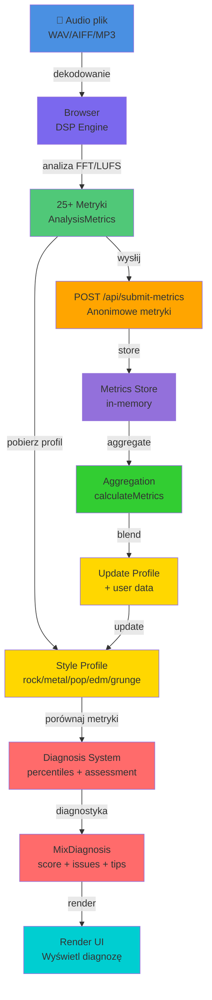
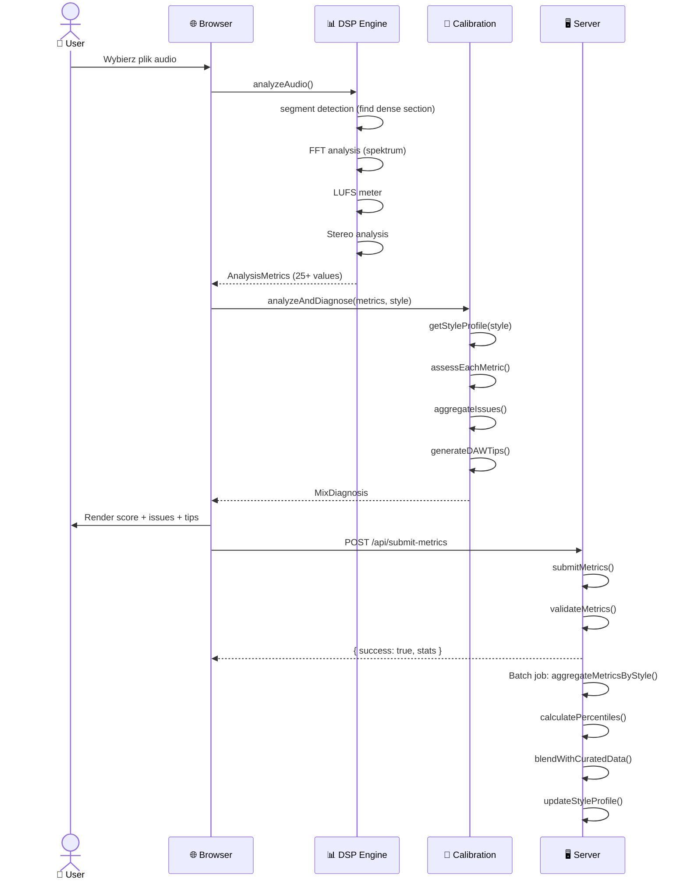

# TruLab Meter - System Kalibracji - Architektura

## Diagram przepływu danych



## Pipeline analizy



## Struktura profilu

```
StyleProfile
├── style: "rock"
├── display_name: "Rock"
├── created_at: 1705000000000
├── last_updated: 1705086400000
├── total_samples: 150
├── curated_weight: 0.6
├── user_data_weight: 0.4
└── metrics:
    ├── lufs: { p10, p25, p50, p75, p90, mean, std_dev, count }
    ├── true_peak: { ... }
    ├── low_ratio: { ... }
    ├── mid_ratio: { ... }
    ├── harshness_index: { ... }
    └── ... (19+ metryk)
```

## Diagnoza

```
User Metrics          Profile Percentiles      Assessment
───────────────      ──────────────────────     ─────────
lufs: -8.5     vs.   p10:-11, p50:-9, p90:-7    ✅ OPTIMAL
true_peak: -1.0 vs. p10:-2.0, p50:-1, p90:-0.3 ⚠️ HIGH
mid_ratio: 0.30 vs. p10:0.28, p50:0.32, p90:0.38 ✅ OPTIMAL
harshness_index: 42 vs. p10:20, p50:35, p90:50 ⚠️ HIGH
```

**Logika statusu:**
```
if metric < p10:        status = "low" ⚠️
if metric > p90:        status = "high" ⚠️
if p10 ≤ metric ≤ p90:  status = "optimal" ✅
if metric < (p10 - 3σ):  status = "critical_low" ❌
if metric > (p90 + 3σ):  status = "critical_high" ❌
```

## Agregacja

```
User 1 → { lufs: -9.1, mid_ratio: 0.30, harshness_index: 35 }
User 2 → { lufs: -8.9, mid_ratio: 0.33, harshness_index: 40 }  
User 3 → { lufs: -9.3, mid_ratio: 0.32, harshness_index: 38 }
    ↓
    Kolekcja 100+ rekordów per styl
    ↓
calculatePercentiles()
    ↓
New Profile Percentiles
{ LUFS: p10: -10.1, p50: -9.1, p90: -8.1
  mid_ratio: p10: 0.29, p50: 0.31, p90: 0.34
  harshness_index: p10: 25, p50: 38, p90: 50 }
    ↓
Blend z Curated (60/40)
    ↓
Update StyleProfile
```

## Typowe metryki po stylu

```
ROCK:
  LUFS:            -11 ... -9 ... -7
  True Peak:       -2.0 ... -1.0 ... -0.3
  Low Ratio:       0.18 ... 0.24 ... 0.30
  Mid Ratio:       0.28 ... 0.32 ... 0.38
  Harshness:       20 ... 35 ... 50
  
METAL:
  LUFS:            -11 ... -9 ... -7
  True Peak:       -1.8 ... -0.8 ... -0.2  (bardziej gorący)
  Low Ratio:       0.22 ... 0.28 ... 0.34  (więcej basu)
  Mid Ratio:       0.26 ... 0.31 ... 0.37
  Harshness:       30 ... 45 ... 60  (bardziej kłujące)
  
POP:
  LUFS:            -10 ... -7 ... -4  (głośniej)
  True Peak:       -1.5 ... -0.5 ... 0.1
  Low Ratio:       0.16 ... 0.22 ... 0.29
  Mid Ratio:       0.34 ... 0.40 ... 0.47  (więcej vocal)
  Harshness:       15 ... 30 ... 45  (mniej kłujące)

EDM:
  LUFS:            -9 ... -6 ... -3  (najgłośniej)
  True Peak:       -1.2 ... -0.2 ... 0.5
  Low Ratio:       0.24 ... 0.32 ... 0.40  (dużo basu)
  Mid Ratio:       0.24 ... 0.30 ... 0.37
  Harshness:       18 ... 34 ... 50
```

## Dokumenty

📄 README.md - Pełna dokumentacja techniczna  
📄 QUICKSTART.md - Quick start guide  
📄 ARCHITECTURE.md - Ten plik  

## Pliki modułów

```
lib/calibration/
├── types.ts              # Interfejsy (25+ typów)
├── percentiles.ts        # Obliczenia matematyczne
├── profiles.ts           # 5 profili stylów
├── diagnosis.ts          # Logika diagnozy (18 metryk)
├── aggregation.ts        # Zbieranie danych
├── config.ts             # Konfiguracja
├── index.ts              # Eksport główny
├── examples.ts           # Testowe przykłady
├── README.md             # Dokumentacja
├── QUICKSTART.md         # Quick start
└── ARCHITECTURE.md       # Ten plik
```

## Integracja z aplikacją

### app/analyze/page.tsx

```typescript
import { analyzeAndDiagnose, recordAnalysis } from "@/lib/calibration";

// Po DSP:
const diagnosis = await analyzeAndDiagnose(metrics, selectedStyle);

// Wyświetl:
<DiagnosisPanel diagnosis={diagnosis} />
  ├── <OverallScore score={diagnosis.overall_score} />
  ├── <IssuesList issues={diagnosis.issues} />
  ├── <StrengthsList strengths={diagnosis.strengths} />
  └── <DAWTips tips={diagnosis.daw_tips} />

// Wyślij do agregacji:
await recordAnalysis(metrics, selectedStyle);
```

## API Routes

### POST /api/analyses/submit-metrics

Wysłanie anonimowych metryk

**Request:**
```json
{
  "style": "rock",
  "metrics": {
    "lufs": -9.2,
    "true_peak": -1.0,
    "low_ratio": 0.24,
    ...
  }
}
```

**Response:**
```json
{
  "success": true,
  "aggregation_stats": {
    "total_records": 42,
    "records_by_style": { "rock": 20, "metal": 15, ... }
  }
}
```

## Prywatność danych

**Zbierane:**
- ✅ Metryki (25+ liczb)
- ✅ Styl
- ✅ Wersja algorytmu

**NIE zbierane:**
- ❌ Audio
- ❌ Nazwy plików
- ❌ Nazwy artystów
- ❌ Dane użytkownika
- ❌ IP address
- ❌ Timestamp (opcjonalnie zaokrąglony)

## Performance

- **Percentile calculation:** ~1ms dla 1000 samples
- **Diagnosis generation:** ~5ms
- **Aggregation (1000 records):** ~50ms
- **Profile update:** ~10ms

## Skalowanie

- **In-memory store:** maks 10,000 rekordów
- **Profile cache:** 5 stylów × metadata
- **Percentile precision:** 0.1 (dB) lub unit

Dla produkcji:
- Przenieść MetricsStore do bazy danych (MongoDB/PostgreSQL)
- Wdrożyć sharding po stylach
- Batch aggregation job (daily scheduled)
